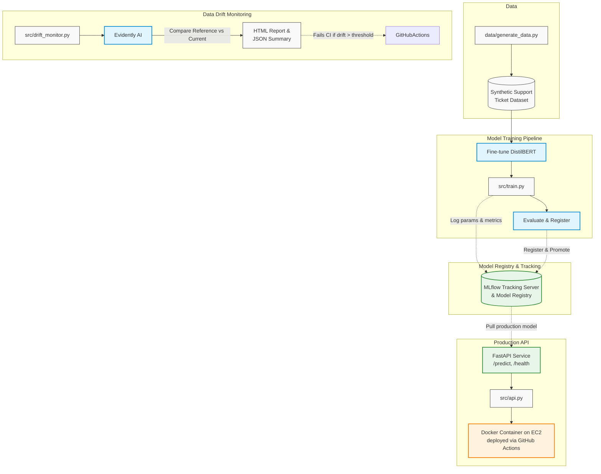

# Ticket Classification Engine — MLOps Reference Project

A production-shaped text classification service: a DistilBERT model that
sorts customer support tickets into `billing` / `technical` / `account`
/ `general`, wrapped in the MLOps tooling that turns "a model that
works on my laptop" into something you'd actually trust in production —
experiment tracking, a model registry with staged promotion, drift
monitoring, CI/CD, and containerized deployment.

This backs the "Production-Grade Text Classification Engine with CI/CD
& Drift Monitoring" project on my resume — every claim there (MLflow
registry promotion, Evidently drift alerts, GitHub Actions CI/CD to
EC2) is implemented and tested in this repo, not just described.

## Architecture



## Repo layout

```
src/
  generate_data.py   synthetic dataset generator (swap for a real source in prod)
  data.py            shared data loading/cleaning — same code path for train & serve
  model.py           HF tokenizer/model wrapper; pretrained + offline-stub loaders
  train.py           fine-tunes, tracks in MLflow, registers + promotes the model
  evaluate.py        batch evaluation against a labeled set; used as a CI quality gate
  drift_monitor.py   Evidently AI data/prediction drift report + CI gate
  api.py             FastAPI service (/predict, /health)
tests/
  test_data.py       data cleaning/splitting logic
  test_api.py        API behavior with a mocked model (fast, no downloads)
.github/workflows/
  ci-cd.yml          lint → test → train+evaluate → docker build → EC2 deploy
                      (+ a separate nightly drift-check job)
Dockerfile           multi-stage build; runtime image bakes in the trained model
docker-compose.yml   MLflow tracking server + the API, for local end-to-end runs
deploy/setup_ec2.sh  one-time EC2 bootstrap (installs Docker, opens the port)
```

## Quickstart (local)

```bash
python -m venv .venv && source .venv/bin/activate

# CPU-only torch first — plain "torch" from PyPI pulls the CUDA/GPU
# build (several GB of nvidia-* packages) that nothing here needs.
pip install --index-url https://download.pytorch.org/whl/cpu torch==2.13.0
pip install -r requirements-dev.txt

# 1. Generate the dataset
python src/generate_data.py

# 2. Train — this downloads distilbert-base-uncased from the Hugging
#    Face Hub, so it needs internet access. Takes a few minutes on CPU.
python -m src.train --model-name distilbert-base-uncased --epochs 3

# 3. Evaluate the model you just trained/registered
python -m src.evaluate --registry-alias production --data data/tickets_train.csv

# 4. Check for drift between the reference and "current" (simulated-drifted) batches
python -m src.drift_monitor --reference data/tickets_reference.csv \
                             --current data/tickets_current.csv \
                             --out-dir artifacts/drift_report
open artifacts/drift_report/drift_report.html   # (or just open it in a browser)

# 5. Serve it
uvicorn src.api:app --reload --port 8000
curl -X POST localhost:8000/predict -H "Content-Type: application/json" \
     -d '{"text": "I was charged twice for my subscription"}'
```

### Fast path, no internet required

`--offline` swaps the pretrained DistilBERT for a tiny randomly-initialized
model with a tokenizer trained on a small in-repo corpus, same code
path, no Hugging Face Hub download. It won't produce an accurate model,
but it proves every part of the pipeline (tokenize → train → MLflow log
→ register → promote) actually runs. This is what CI uses for the fast
test/smoke-check job that runs on every push; real training is a
separate, slower job (see CI/CD below).

```bash
python -m src.train --offline --epochs 1
pytest tests/ -v
```

### Docker

```bash
docker compose up --build
# api      -> http://localhost:8000
# mlflow   -> http://localhost:5000
```

The image bakes in whatever's at `artifacts/model` at build time —
train first, then `docker compose up --build`. See the comment block at
the top of `docker-compose.yml` for the alternative registry-backed
mode, where the container instead pulls the current `production`-tagged
model from a running MLflow server at startup — useful when you want to
promote a new model without rebuilding the image.

## CI/CD pipeline

`.github/workflows/ci-cd.yml` has three separate triggers, deliberately
kept apart because they run at very different cadences in a real system:

| Trigger | Jobs | Why separate |
|---|---|---|
| `push`/`PR` to `main` | lint → test → train+evaluate → docker build → EC2 deploy | Every code change should ship fast; this is the "someone fixed a bug in the API" path |
| `schedule` (nightly, `0 3 * * *`) | drift-check | Drift is a data-over-time question, not a per-commit one |
| `workflow_dispatch` | any job, manually | Ad-hoc re-runs (e.g. re-check drift after a data pipeline fix) |

The `test` job never downloads a real model (that's what `--offline` is
for), so it stays fast and doesn't depend on Hugging Face Hub being
reachable from the runner. The `train-and-evaluate` job does the real
fine-tune and — importantly — **fails the build** if validation accuracy
drops below `--min-accuracy`, which is what stops a regressed model
from ever reaching the Docker image.

## MLflow registry & promotion policy

`src/train.py` registers every training run as a new version of the
`ticket-classification` model and tags it with `val_accuracy` /
`val_f1_macro`. It then:

- always points the `staging` alias at the new version (so it's
  reviewable), and
- moves the `production` alias to it too, **only if** validation
  accuracy clears `PRODUCTION_ACCURACY_THRESHOLD` (0.85 by default, in
  `src/train.py`).

This uses MLflow's current alias-based registry API rather than the
older Staging/Production "stages" concept, which MLflow has deprecated
as of 2.9 — worth knowing if you're used to older MLflow tutorials.

## Drift monitoring

`src/drift_monitor.py` compares a reference batch (the distribution the
model was validated on) against a current batch, using Evidently AI's
`DataDriftPreset` over text-derived features (length, word count) and
the label/prediction distribution. `data/tickets_current.csv` is
seeded with an intentionally shifted class balance (more `technical`
tickets, some out-of-vocabulary phrasing) so the drift check has
something real to catch — running it produces a clear share-of-drifted-
columns signal and an HTML report you can open directly.

In a real deployment, `--current` would point at a rolling window of
actual recent inference requests (logged from the API) instead of a
static CSV — the summary/CI-gate logic doesn't change either way.

## What's actually verified vs. not

This repo was rebuilt and re-verified from scratch in a fresh
environment (the original dev sandbox this was first built in got
reset partway through an earlier conversation) — so everything below
was checked again, not assumed to still work from before.

**Verified by actually running it, in this exact environment:**
- Full offline training pipeline (tokenize → HF `Trainer` → MLflow
  log → model registry → alias-based promotion) — ran clean.
- `evaluate.py` against the freshly trained checkpoint.
- `drift_monitor.py` — correctly detects the injected class-balance
  shift (technical tickets 25%→58%) between the reference and current
  datasets.
- The FastAPI service as a real subprocess (not just an in-process
  test shortcut) — `/health` and `/predict` both hit over actual HTTP.
- **11/11 pytest tests pass** on a simulated fresh checkout (no
  pre-trained model present), matching what CI will see.
- `ruff check` is clean.
- **The Dockerfile was linted with the real `hadolint` binary**
  (downloaded from its GitHub release, not guessed at) — found and
  fixed three real issues: an unpinned apt package version, a
  non-numeric `USER` directive, and a `HEALTHCHECK CMD` using shell
  form instead of the recommended JSON array form. One info-level
  finding (two consecutive `RUN` layers for pip installs) is
  intentionally kept as-is and documented in the Dockerfile itself —
  it's a deliberate Docker layer-caching choice, not an oversight.
- **Docker itself was actually installed and its daemon actually
  started** in this dev sandbox (`apt-get install docker.io`, then
  `dockerd` — both worked). `docker build` was attempted for real
  against this exact Dockerfile and got as far as pulling the base
  image before failing — every major container registry (Docker Hub,
  GHCR, GCR, ECR public) returns `403 Forbidden` from this sandbox's
  network policy. That's a more precise finding than "Docker isn't
  available here" — the tooling works, the daemon works, only the
  registry pull is blocked.

**Not verified:**
- The actual `docker build` completing — blocked by the registry
  restriction above, not by anything wrong with the Dockerfile itself
  (which passed both hadolint and manual review, and applies the
  CPU-only-torch and non-root-user lessons already confirmed necessary
  once).
- The real `distilbert-base-uncased` fine-tune — this sandbox can't
  reach huggingface.co, so only the `--offline` stub path (deliberately
  built to prove the pipeline wiring without needing that access) has
  been run here. The real fine-tune needs to be run somewhere with
  internet access — locally, or in GitHub Actions, which does have it.
- GitHub Actions / EC2 actually executing on real infrastructure.

## Design decisions worth knowing (likely interview questions)

- **Why synthetic data?** Keeps the repo runnable by anyone with no
  external accounts/downloads. `load_raw_data()` in `src/data.py` is
  the one seam to swap for a real source.
- **Why a custom torch `Dataset` instead of the `datasets` library?**
  One fewer dependency for a project this size; `Trainer` only needs
  `__len__`/`__getitem__`, so a plain `Dataset` subclass is enough.
- **Why does the Docker image bake in the model instead of always
  loading from the registry?** Both are implemented (`MODEL_SOURCE=local`
  vs `registry` in `src/api.py`). Baked-in is simpler and makes the
  image itself the immutable deployable artifact; registry-mode
  decouples app deploys from model promotions. Real teams pick based on
  how often each changes — this repo defaults to baked-in and documents
  the alternative rather than picking one dogmatically.
- **Known gap:** class balance and vocabulary are still fairly clean
  synthetic text; a real ticket dataset would need more preprocessing
  (PII scrubbing, language detection, much messier text) before this
  training pipeline would need to change to handle it.

## Testing

```bash
pytest tests/ -v          # 11 tests, ~seconds, no model download needed
ruff check src/ tests/    # what CI's lint job runs
```
